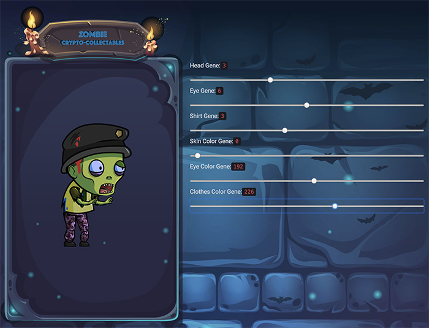
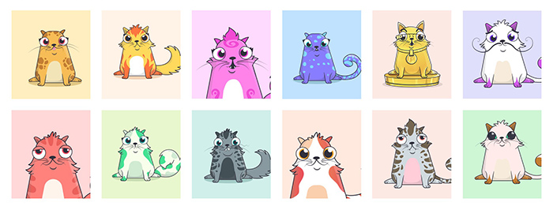

# Smart Contracts
a collection of smart contracts that I've learnt or write by myself

### 1. Crypto Zombies
a basic game which was designed to learn how to write smart contracts in Solidity 

    

### 1. Crypto Kitties
CryptoKitties has done a great job of demonstrating what blockchains can be used for beyond just simple financial transactions 

    

